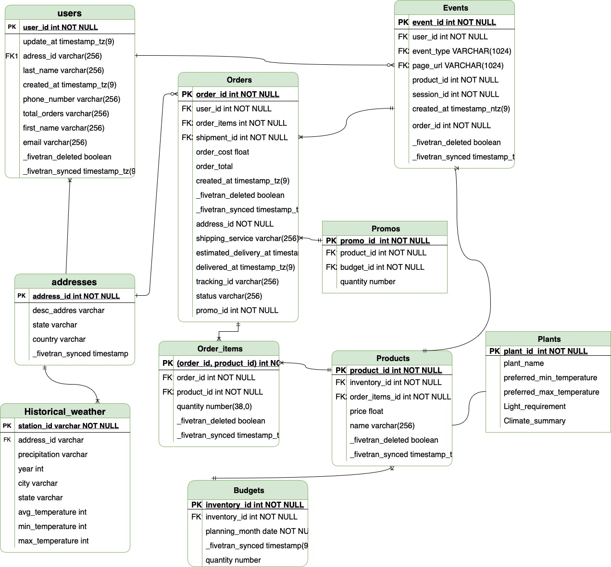
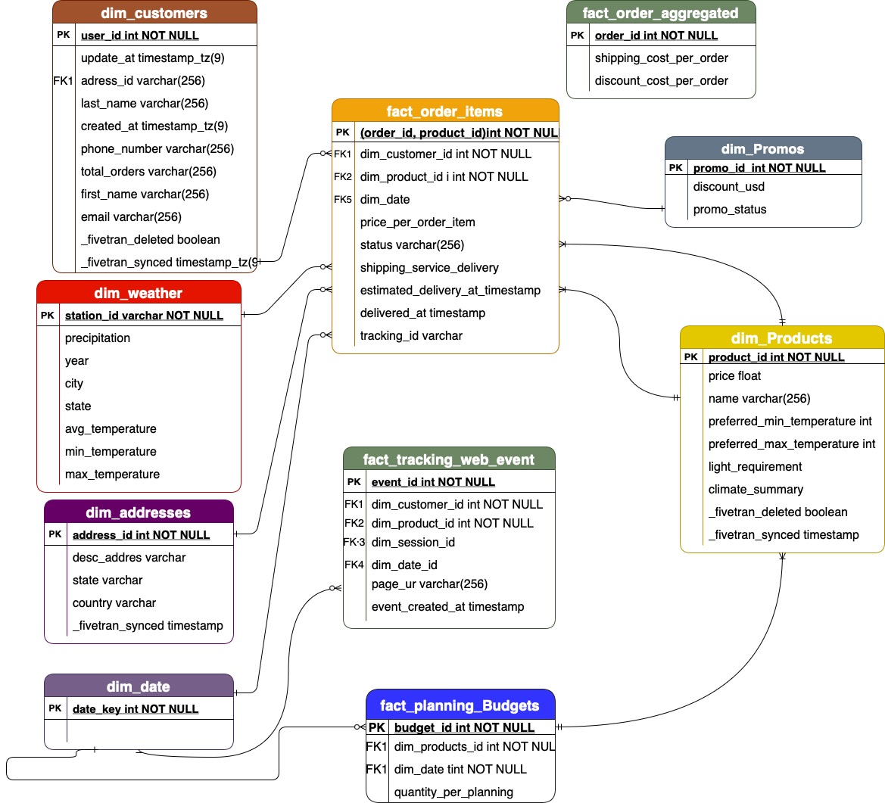

# Curso data engineering

This project is related to my Final Project related to Cívica Data Engineering course. 
For contact me you have my [Linkedin](https://linkedin.com/in/jose-magalhaes-39a50718a). 

# Retail Web plant sales Analytics - dbt and Snowflake project.

## Overview
This dbt project models and transforms raw data into a clean and reliable source of truth to support:
Plant recommendation based on local climate compatibility.
Customer behavior analysis from web session and orer activity.
Budget and promotional planning through aggregated sales and discount insights.

## Project Structure

```plaintext
├── models/
│   ├── staging/  # Raw staging layer (stg_)
|   |          ├── google_sheets/
│   │          ├── sql_server_dbo/
|   |          ├── weather/
│   │          └── plant_details /     
│   ├── marts/
│   │   ├── core/             # Dimension and Fact tables
│   │   ├── intermediate/     # Intermediate logic (joins, transformations)
│   │   ├── marketing/        # Final marketing use cases & reporting models
│   │   └── financial /       # Final use cases related to aggregated order model
├── macros/                   # Custom macros (e.g., temperature conversion)
├── snapshots/                # Slowly Changing Dimensions (e.g., customers)
├── seeds/                    # Static data like plants and climate zones
├── tests/                    # dbt tests (singular + generic)
├── analyses/                 # ad hoc queries and exploration
├── dbt_project.yml
└── packages.yml
```

# DER


# Dimensional Model

# Core Components
| Model                             | Purpose                                                               |
| --------------------------------- | --------------------------------------------------------------------- |
| `dim_products`                    | Plant catalog with climate suitability attributes                     |
| `dim_customers`                   | Enriched customer data with snapshot tracking                         |
| `dim_addresses`                   | Address information linked to states for weather joins                |
| `dim_weather`                     | Aggregated weather data per state and season                          |
| `dim_date`                        | Calendar table generated via `dbt_date` package                       |
| `fct_order_items`                 | Granular order and item-level facts with pricing and timestamps       |
| `fct_aggregate_orders`            | Order-level facts including discounts and shipping costs              |
| `fct_web_tracking_events`         | Web session logs to analyze customer navigation and behavior          |
| `product_customer_match_location` | Recommendations based on weather and plant compatibility              |

# Uses cases
Match plant products with customers based on average state temperatures and plant tolerance range.

# Testing & Quality
Generic Tests: `not_null`, `unique`, `accepted_values`
Customized test: validate that the state is not missing to find the state of customer `test_order_missing_state`

dbt test

# Advanced Features
Temperature conversion macro (F to C)
Incremental and snapshot logic for customer and orders

# Feature Enhancements
Make a Visualization UI for its consume
Add use cases:
 - Popularity by season
 - Holiday sales 
 - Real Time weather and external behavior signals 


